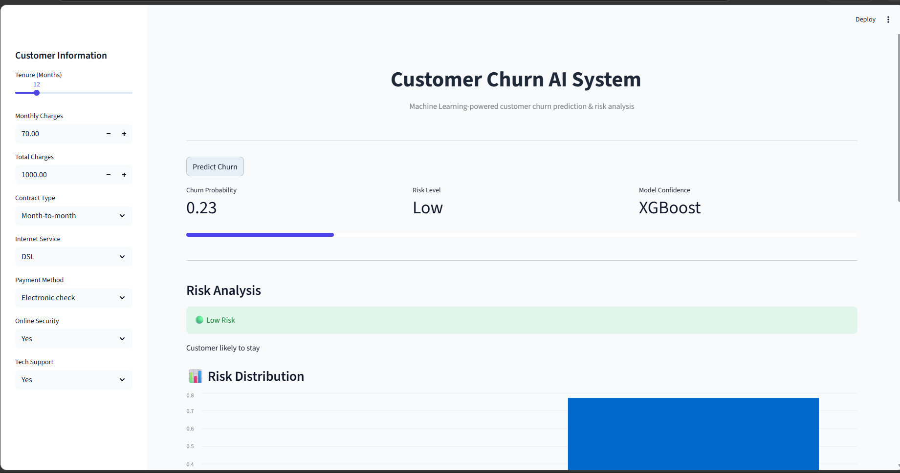
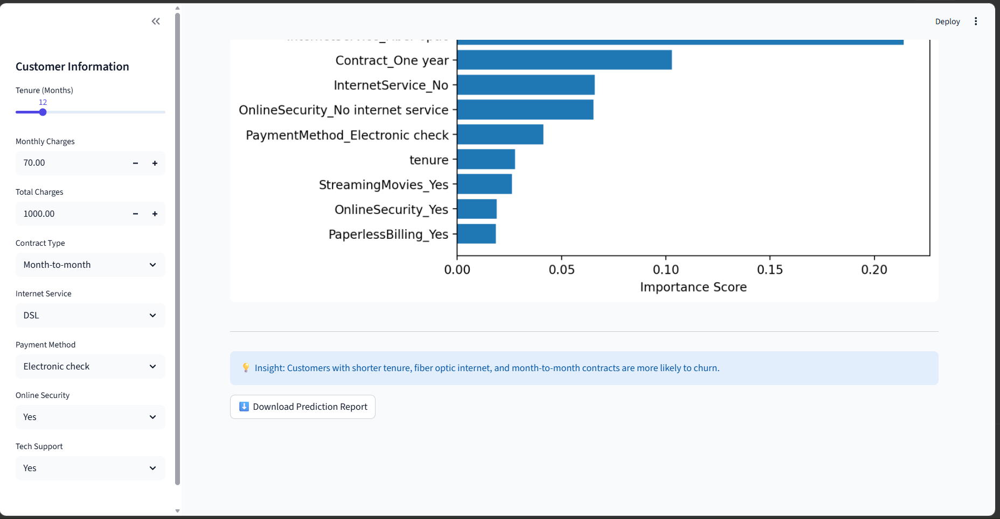
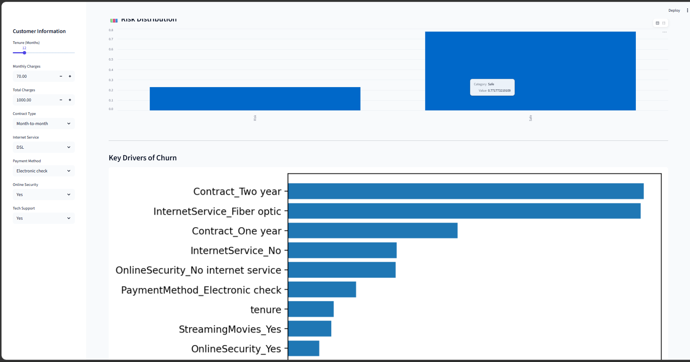

# Customer-churn-ai
End-to-end Machine Learning system that predicts customer churn using XGBoost. Includes an interactive Streamlit web application, feature importance analysis, and business insights to support retention strategies.

# Customer Churn AI System

An end-to-end Machine Learning project that predicts customer churn using **XGBoost**, with an interactive **Streamlit web application** and business intelligence insights.


##  Live Demo
https://customer-churn-ai-fuxakulppmjh4whptjr6wp.streamlit.app/


## Project Overview

Customer churn is a critical problem for businesses as losing customers directly impacts revenue.

This project builds an AI-powered system that:
- Predicts whether a customer will churn
- Calculates churn probability in real-time
- Provides risk classification (Low / Medium / High)
- Explains important factors influencing churn
- Generates actionable business recommendations


##  Problem Statement

Telecom companies lose customers due to:
- High service charges
- Poor customer experience
- Lack of engagement
- Contract flexibility issues

This system helps identify at-risk customers early.


## Dataset

The dataset includes customer information such as:

- Contract type
- Internet service
- Payment method
- Tenure
- Monthly & Total charges
- Service subscriptions

Target variable:
- `Churn` (Yes / No)


##  Technologies Used

- Python
- Pandas
- NumPy
- Scikit-learn
- XGBoost
- Streamlit
- Matplotlib
- Joblib


##  Machine Learning Model

- Algorithm: **XGBoost Classifier**
- Approach: Supervised Learning
- Output: Churn probability (0–1)

### Model Evaluation:
- Accuracy: ~79%
- Handles class imbalance well
- Feature importance used for interpretability


##  Features

###  Input Features
- Tenure
- Monthly Charges
- Total Charges
- Contract Type
- Internet Service
- Payment Method
- Online Security
- Tech Support


###  Output Features
- Churn Probability Score
- Risk Level (Low / Medium / High)
- Feature Importance Chart
- Risk Distribution Visualization
- Downloadable Prediction Report


##  Application Interface

Built using Streamlit:

- Sidebar inputs for customer data
- Real-time prediction
- Interactive charts
- Business insights section
- Downloadable CSV report


## 📷 Screenshots

### Dashboard


### Feature Importance


### Risk Distribution


##  Power BI Dashboard

This project also includes a Power BI dashboard for customer churn analytics and business intelligence reporting.

### Features
- Customer segmentation
- Churn rate analysis
- Contract analysis
- Revenue insights
- Interactive slicers and filters

Power BI File:
[Download Dashboard]()
[View Dashboard](assets/PowerBi_Dashboard.png)

##  How to Run Locally

```bash
# Clone repository
git clone https://https://github.com/Anordaddy/Customer-churn-ai.git

# Install dependencies
pip install -r requirements.txt

# Run Streamlit app
streamlit run app.py
